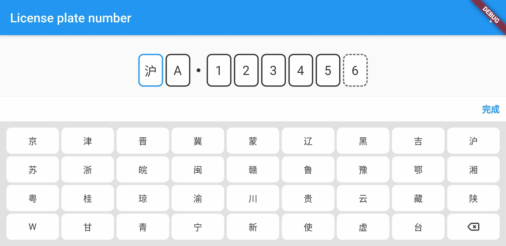

# license_plate_number

[](https://img.shields.io/pub/v/license_plate_number)

#### Language: [English](README.md) | [中文简体](README_CN.md) 

Flutter package for inputting chinese license plate number.

- Build-in one light style and one dark style, and the style can be changed.
- Supporting landscape.
- Plate numbers can be edited separately.





## How to use

### Install

```yaml
dependencies:
  license_plate_number: ^2.0.0
```

### Basic usage

Package includes two main widgets，`PlateInputField` and `PlateKeyboard`.

`PlateInputField` is for inputting the plate number.

```dart
Container(
  child: PlateInputField(
    placeHolder: '沪A12345',
    style: PlateStyle.light,
    inputFieldWidth: 40,
    inputFieldHeight: 54,
    onChange: (List<String> array, String value) {
      // e.g.
      // array ['沪', 'A', '1', '2', '3', '4', '5', '6']
      // value 沪A123456
    },
  );
  alignment: Alignment.center,
)
```

`PlateKeyboard` is usually not used directly. It is controlled by `PlateInputField`. But we also provide `KeyboardController` to show/hide the keyboard by yourself.

```dart
/// KeyboardController
KeyboardController _keyboardController = KeyboardController();

/// Show keyboard
_keyboardController.showKeyboard(context);

/// Hide keyboard
_keyboardController.hideKeyboard();

/// Is keyboard showing
_keyboardController.isKeyboardShowing();
```

```dart
PlateInputField(
  /// Pass KeyboardController to PlateInputField
  keyboardController: _keyboardController,
);
```


### Styles

Two default styles was build in，but self-defined style is also supported.

```dart
/// 1. Use constructor.
PlateStyles(
  /// Text style of plate input field.
  plateInputFieldTextStyle: TextStyle(
    color: Color(0xFFFFFFFF),
    fontSize: 20,
    fontWeight: FontWeight.normal,
  ),
  /// Text style of new energy place holder.
  newEnergyPlaceHolderTextStyle: TextStyle(
    color: Color(0xFFDDDDDD),
    fontSize: 10,
    fontWeight: FontWeight.normal,
  ),
  /// Background color of input field.
  plateInputFieldColor: Color(0xFF4A4A4A),
  /// Border of input field.
  plateInputBorder: Border.fromBorderSide(BorderSide(
    color: Color(0xFFFFFFFF),
    width: 2,
    style: BorderStyle.solid,
  )),
  /// Border of focused input field.
  plateInputFocusedBorder: Border.fromBorderSide(BorderSide(
    color: Color(0xFF2196F3),
    width: 2,
    style: BorderStyle.solid,
  )),
  /// Border radius of input field.
  plateInputBorderRadius: const Radius.circular(8.0),
  /// Color of Separator between city code and numbers.
  plateSeparatorColor: Color(0xFFFFFFFF),
  
  /// Background color of keyboard.
  keyboardBackgroundColor: Color(0xFF131313),
  /// Text color of key text.
  keyboardButtonTextColor: Color(0xFFFFFFFF),
  /// Background color of keys.
  keyboardButtonColor: Color(0xFF4A4A4A),
  /// Background color of disabled keys.
  keyboardButtonDisabledColor: Color(0x994A4A4A),
);
```

```dart
/// 2. Copy with a default style.
PlateStyles.dark.copyWith(
  keyboardBackgroundColorDark: Color(0xFF000000),
);
```

